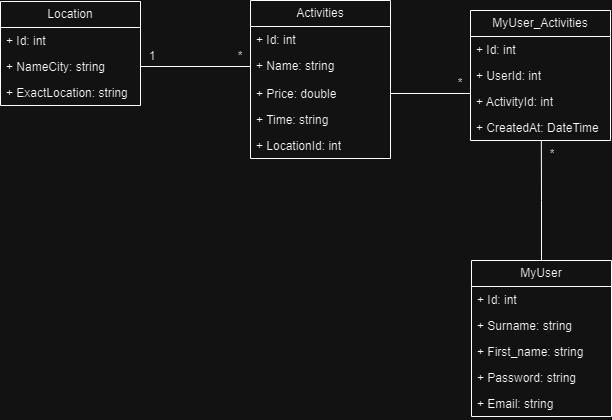

# DotNetActivityApp
This application is written in .NET 6. Its purpose is to allow users to display their own data after logging in, search for activities with corresponding locations, and provide suggestions for activities such as going to the cinema, going to the theater, or even doing a thorough cleaning at home.
## About the application
The application is Dockerized, with the Postgresql database and the application running in separate containers. The application operates on port 9090:80, while Postgresql operates on port 5432:5432. Within the project, a Swagger documentation is created to detail the individual APIs, enabling testing directly through it.
The user utilizes BasicAuth for logging in. It should be noted that a user must first be created to enable logging in. Once logged in, the user gains access to many more endpoints. If the username or password is incorrect, a 401 error code is received along with a corresponding error message.
In the database, we have four different tables, which are as follows:
- Location
- Activities
- MyUser
- MyUser_Activities
